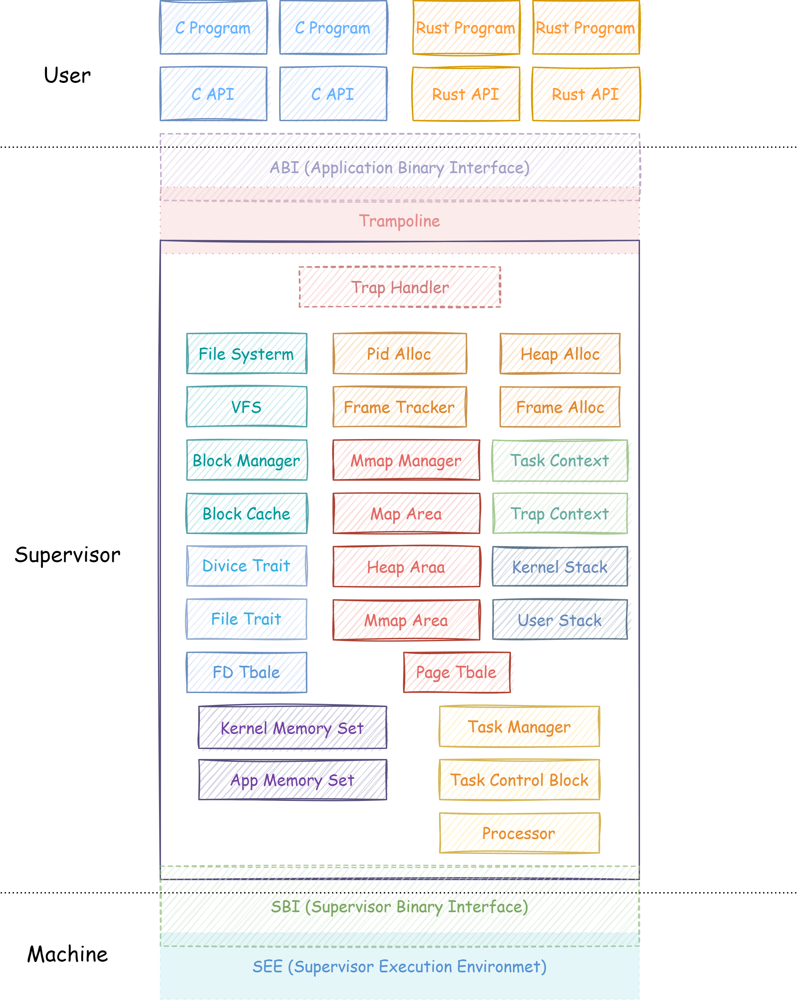
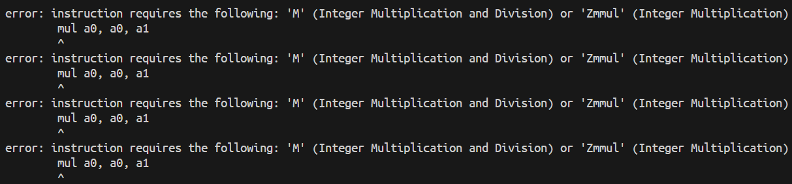
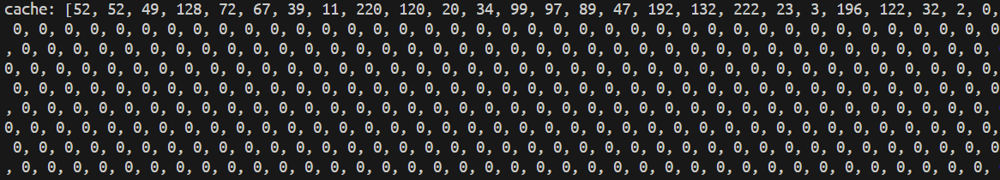
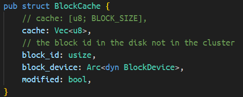
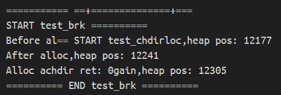

# Bite The Disk


## Intro

该项目由 HDU 三位同学在历届内核以及 Linux 实现的基础上，参考实现的一个可支持多核 CPU 的简单 OS 内核

## Features

- IO
    - 完全支持标准 FAT32 镜像的读写，使用 LRU 算法建立了块缓存层提高效率
    - 借用 `buddy` 内存分配器，在一定程度上避免由物理内存不连续所导致的缓存丢失问题

- 进程
    - 依靠时间片的调度算法
    - 进程间信号的产生与处理
    - 多核进程 PID 池减轻加锁带来的性能开消
    - fork/exec 进程地址空间写时复制(COW)
    - 兼容 Linux/ELF 的虚拟地址空间

- 内存
    - 内存懒加载
    - COW
    - mmap/munmap 等系统调用

## 项目概况

### 文档

[区域赛项目文档](docs/)

### 项目结构
| 目录      | 简述                                     |
| --------- | ---------------------------------------- |
| .vscode   | VSCode, RA, C/C++ 相关配置               |
| docs      | 项目相关文档                             |
| fat32     | FAT32 文件系统                           |
| misc      | 系统调用测例，util 脚本等                |
| kernel    | 内核源码，SBI                            |
| workspace | 用于做一下临时的挂载等任务，方便内核调试 |

### 整体架构

<div class="warp">
  
</div>

### Build

```shell
make run          # 构建并在 QEMU 上运行
make debug-server # 按照 debug 构建并启动 dbg-server
make debug        # 链接 dbg-server
```
### Next Step
利用 `Hifive-Unmatched` 大小核特性，参考 goroutine 尝试优化进程调度

## 遇到的问题与解决

- 工具链默认不支持乘法指令:

    <div class="warp">
      
    </div>

    可以通过伪指令 `.attribute arch, "rv64gc"` 来解决

    <https://github.com/riscv-non-isa/riscv-asm-manual/blob/master/riscv-asm.md#-attribute>

- VirtIOBlk 物理内存不连续时导致缓存数据丢失

    其实这个问题困扰了我们许久，很长时间找不到问题的原因。

    <div class="warp">
      
    </div>

    使用 `Vec<u8>` 代替 `u8` 数组:

    <div class="warp">
      
    </div>

    <https://github.com/rcore-os/rCore-Tutorial-Book-v3/issues/104#issuecomment-1139303285>

    <https://github.com/rcore-os/rCore-Tutorial-v3/pull/79#issue-1251450181>

- 多核乱序输出

   <div class="warp">
      
    </div>

  参考 `xv6-riscv` 解决:

  ```rust
  // kernel/src/macros/on_boot.rs

  use core::sync::atomic::AtomicBool;

  pub static mut BOOTED: AtomicBool = core::sync::atomic::AtomicBool::new(false);

  macro_rules! synchronize_hart {
      () => {{
          unsafe {
              $crate::macros::on_boot::BOOTED.store(true, core::sync::atomic::Ordering::Relaxed);
              core::arch::asm!("fence");
          }
      }};
  }

  macro_rules! wait_for_booting {
      () => {{
          unsafe {
              while !$crate::macros::on_boot::BOOTED.load(core::sync::atomic::Ordering::Acquire) {}
          }
      }};
  }

  // kernel/src/main.rs

  #[cfg(feature = "multi_harts")]
  #[no_mangle]
  pub fn meow() -> ! {
      if hartid!() == 0 {
          init_bss();
          unsafe { set_fs(FS::Dirty) }
          lang_items::setup();
          mm::init_frame_allocator();
          mm::enable_mmu();
          trap::init();
          trap::enable_stimer_interrupt();
          timer::set_next_trigger();
          fs::init();
          task::add_initproc();

          synchronize_hart!()
      } else {
          wait_for_booting!();

          unsafe { set_fs(FS::Dirty) }

          mm::enable_mmu();
          trap::init();
          trap::enable_stimer_interrupt();
          timer::set_next_trigger();
      }

      task::run_tasks();
  }
  ```

  <https://github.com/mit-pdos/xv6-riscv/blob/f5b93ef12f7159f74f80f94729ee4faabe42c360/kernel/main.c#L32>

- FAT32 文件系统规范问题：

    - 没有根目录短目录项实体：最初我们 FAT32 库为根目录记录存储了实体，但发现没法解析 Linux 格式化出的 FAT32 文件系统镜像，虽然看文档时对 FAT32 的根目录没有目录项有印象，但实际实现过程中为了方面记录了实体，最后查阅文档以及参考上届作品的 FAT32 文件系统实现时发现并解决了这个问题。
    - 目录文件的短目录项的文件大小字段为 0：最初我们 FAT32 库的读参考了部分 eazy-fs 的文件读，其中利用文件大小来判断边界范围等问题，虽然看文档时对 目录文件的文件大小为 0 也有映像，但是由于在实现文件读时使用了文件大小作为判断依据，导致没法解析文件系统内容。最后也是通过查阅文档以及参考上届作品的 FAT32 文件系统实现时才发现并解决了这个问题。


## 关联文档 / 链接 / 相关 `issue`


- 乘法指令问题:

    https://github.com/riscv-non-isa/riscv-asm-manual/blob/master/riscv-asm.md#-attribute
- 内存地址不连续导致缓存丢失:

    https://github.com/rcore-os/rCore-Tutorial-Book-v3/issues/104#issuecomment-1139303285

    https://github.com/rcore-os/rCore-Tutorial-v3/pull/79#issue-1251450181

- 多核乱序输出:

    https://github.com/mit-pdos/xv6-riscv/blob/f5b93ef12f7159f74f80f94729ee4faabe42c360/kernel/main.c#L32

- [debug.md](docs/debug.md)
- [commit-spec.md](docs/commit-spec.md)
