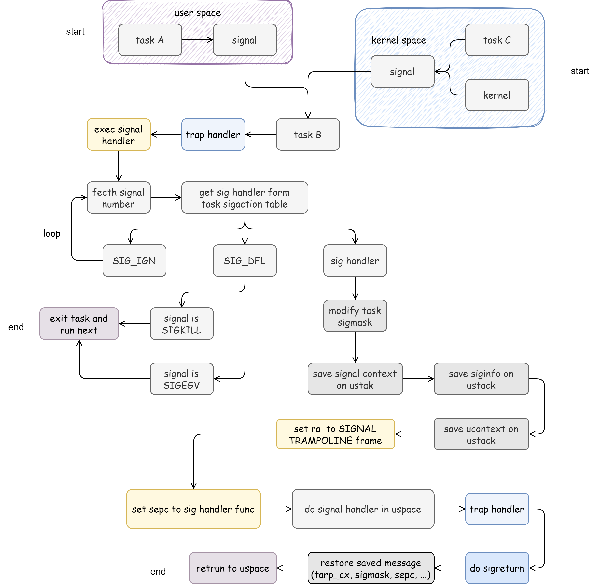

# 信号系统与信号处理

### 信号有两种来源

1. 任务在正常执行时，内核或者其他进程给它发送了一个信号（异步信号）
2. 在处理 Trap 的时候内核将相应的信号（同步信号）直接加到任务控制块中（由进程自身的执行触发）

内核会在 Trap 处理完成即将返回用户态之前检查要返回到的进程是否还有信号待处理。如果需要处理的话，取决于进程是否提供该种信号的处理函数：

- 如果进程通过的 `sigaction` 系统调用提供了相应信号的处理函数，那么内核会将该进程 Trap 进来时的上下文信息（trap_cx, ucontext, siginfo,...) 保存下来，并回到用户态执行进程提供的处理函数，并在处理结束后通过 sigreturn 系统调用恢复进程原来保存的上下文，等到再次回到用户态的时候，便会继续进程在处理信号之前的执行。
- 如果进程未提供处理函数，如SIGIGN, SIGDFL，此时，内核会直接默认的方式处理信号。

```rust
pub struct TaskControlBlock {
	...
    // mutable according to clone flags
    pub sigactions: Arc<RwLock<[SigAction; MAX_SIGNUM as usize]>>,
    // mutable
    inner: RwLock<TaskControlBlockInner>,
}
```

```rust

pub struct TaskControlBlockInner {
	...
    pub pending_signals: SigSet,
    pub sigmask: SigMask,
}
```

### BTD-OS 信号处理流程



### 同步信号的产生

```rust
#[no_mangle]
pub fn user_trap_handler() -> ! {
	...
    match scause.cause() {
        ...
        Trap::Exception(Exception::StoreFault)
        | Trap::Exception(Exception::StorePageFault)
        | Trap::Exception(Exception::LoadFault)
        | Trap::Exception(Exception::LoadPageFault) => {
            let va: VirtAddr = (stval as usize).into();
            if va > TRAMPOLINE.into() {
                current_add_signal(SigSet::SIGSEGV);
            }
            let task = current_task().unwrap();
            let lazy = task.check_lazy(va);
            if lazy != 0 {
                current_add_signal(SigSet::SIGSEGV);
            }
        }
        Trap::Exception(Exception::InstructionFault)
        | Trap::Exception(Exception::InstructionPageFault) => {
            let task = current_task();
            drop(task);
            current_add_signal(SigSet::SIGSEGV);
        }

        Trap::Exception(Exception::IllegalInstruction) => {
            current_add_signal(SigSet::SIGILL);
        }

        Trap::Interrupt(Interrupt::SupervisorTimer) => {
            suspend_current_and_run_next();
        }

        _ => panic!(
            "trap {:?} is unsupported, stval = {:#x}!",
            scause.cause(),
            stval
        ),
    }
    check_interval_timer();
    if !is_sigreturn {
        exec_signal_handlers();
    }
    trap_return();
}
```

### 异步信号的产生

```rust
// kenel/src/syscall/impls/process.rs
pub fn sys_kill(pid: usize, signal: u32) -> Result {
	...
    let signal = 1 << (signal - 1);
    if let Some(task) = pid2task(pid) {
        if let Some(flag) = SigMask::from_bits(signal) {
            task.inner_mut().pending_signals |= flag;
            Ok(0)
        } else {
            return_errno!(Errno::EINVAL, "invalid signal, signum: {}", signal);
        }
    } else {
        Ok(0)
    }
}
```

### 信号处理

sigaction 的更改：

```rust
// kernel/src/syscall/impls/process.rs
pub fn sys_sigaction(signum: isize, act: *const SigAction, oldact: *mut SigAction) -> Result {
	...
    if act as usize != 0 {
        let mut sigaction = task.sigactions.write();
        if oldact as usize != 0 {
            copyout(token, oldact, &sigaction[signum as usize]);
        }
		...
        sigaction[signum as usize] = sa;
    }
    Ok(0)
}
```

sigmask 的更改：

```rust
// kernel/src/syscall/impls/process.rs
pub fn sys_sigprocmask(how: usize, set: *const usize, old_set: *mut usize, sigsetsize: usize) -> Result {
	...
    let how = MaskFlags::from_how(how);
    match how {
        MaskFlags::SIG_BLOCK => old_mask |= new_set,
        MaskFlags::SIG_UNBLOCK => old_mask &= !new_set,
        MaskFlags::SIG_SETMASK => old_mask = new_set,
        _ => panic!("ENOSYS"),
    }
    task_inner.sigmask = old_mask;
}
```

用户态执行进程提供的处理函数之前，内核的处理（保存上下文）：

```rust
pub fn exec_signal_handlers() {
    let task = current_task().unwrap();
    let mut task_inner = task.inner_mut();
    if task_inner.pending_signals == SigSet::empty() {
        return;
    }
    loop {
        // take out the first signal of pending
        let signum = match task_inner
            .pending_signals
            .difference(task_inner.sigmask)
            .fetch()
        {
            Some(s) => s,
            None => return,
        };
        task_inner.pending_signals.sub(signum);
        let sigaction = task.sigactions.read()[signum as usize];

        // if signal handler exists, then prepare to jump to handler
        let handler = sigaction.sa_handler;
        match handler {
            SIG_IGN => {
                // return;
                continue; // loop
            }
            SIG_DFL => {
                if signum == Signal::SIGKILL as u32 || signum == Signal::SIGSEGV as u32 {
                    // info!("[Kernel] task/mod(exec_signal_handlers) pid:{} signal_num:{}, SIG_DFL kill process", pid, signum);
                    drop(task_inner);
                    drop(task);
                    exit_current_and_run_next(-(signum as i32));
                }
                return;
            }
            _ => {
                // block the current signal and the signals in sigaction.sa_mask
                let mut sigmask = sigaction.sa_mask.clone();
                if !sigaction.sa_flags.contains(SAFlags::SA_NODEFER) {
                    sigmask.add(signum);
                }
                // save the old sigmask
                let old_sigmask = task_inner.sigmask.clone();
                sigmask.add_other(old_sigmask);
                // set the signal mask to sigmask
                task_inner.sigmask = sigmask;
                // put the SignalContext data into the stack.
                let trap_cx = task_inner.trap_context();
                // save the trap context and old_sigmask to sig_context
                let sig_context = SignalContext::from_another(trap_cx, old_sigmask);
                trap_cx.x[10] = signum as usize; // a0 (args0 = signum)

                // If SA_SIGINFO is included in sa_flags, put siginfo and ucontext into the stack.
                // However, we did not differentiate whether the flag is present or not. We handled it uniformly.

                let memory_set = task.memory_set.read();
                let token = memory_set.token();
                drop(memory_set);

                trap_cx.x[2] -= core::mem::size_of::<UContext>(); // sp -= sizeof(ucontext)
                let ucontext_ptr = trap_cx.x[2];
                trap_cx.x[2] -= core::mem::size_of::<SigInfo>(); // sp -= sizeof(siginfo)
                let siginfo_ptr = trap_cx.x[2];

                trap_cx.x[11] = siginfo_ptr; // a1 (args1 = siginfo)
                trap_cx.x[12] = ucontext_ptr; // a2 (args2 = ucontext)
                let mut ucontext = UContext::empty();
                ucontext.uc_mcontext.greps[1] = trap_cx.sepc; //pc
                copyout(token, ucontext_ptr as *mut UContext, &ucontext);

                trap_cx.x[2] -= core::mem::size_of::<SignalContext>(); // sp -= sizeof(sigcontext)
                let sig_context_ptr = trap_cx.x[2] as *mut SignalContext;
                copyout(token, sig_context_ptr, &sig_context);

                trap_cx.x[1] = SIGNAL_TRAMPOLINE; // ra = user_sigreturn

                trap_cx.sepc = handler; // sepc = handler
                return;
            }
        }
    }
}
```

通过 sigreturn 系统调用恢复进程原来保存的上下文：

```rust
pub fn sys_sigreturn() -> Result {
	...
    let sig_context_ptr = trap_cx.x[2];
    trap_cx.x[2] += core::mem::size_of::<SignalContext>();
    let siginfo_ptr = trap_cx.x[2];
    trap_cx.x[2] += core::mem::size_of::<SigInfo>();
    let ucontext_ptr = trap_cx.x[2];
    trap_cx.x[2] += core::mem::size_of::<UContext>();

    let ucontext = translated_ref(token, ucontext_ptr as *const UContext);
    let sig_context = translated_ref(token, sig_context_ptr as *mut SignalContext);
    let sigmask = sig_context.mask.clone();
    *trap_cx = sig_context.context.clone();
    task_inner.sigmask = sigmask;
    trap_cx.sepc = ucontext.uc_mcontext.greps[1];
    Ok(0)
}
```

