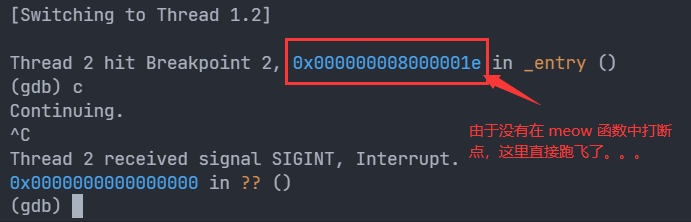

# Debug

```bash
# 从当前 pc 开始显示 11 条指令，11 条是不发生折叠的极限（也可能只是我这是这样）
(gdb) x/11i $pc
```


```bash
(gdb) b *0x80000000 # 在内核第一条指令处打个断点
(gdb) c             # continue 执行到断点处
```


```bash
(gdb) si # si 单步执行 (step in，会嵌入函数具体流程中)
```

需要注意的是，由于我们现在是多核运行，所以在代码执行过程中会出现系统线程的切换，例如下面这样：

```bash
(gdb) c
Continuing.
[Switching to Thread 1.2]
```

这时候我们要看当前线程的状态，根据当前状态进行调试，该打断点的地方不要忘了打断点，不然会跑飞

像是这样，只能用 Ctrl + C 来掐死 (主要是我也没去找其他可能的方法 😛):



看到地址了吗，直接归零，而且这块地址是不可访问的，只能卡在这了，除非扬了当前的 shell 重来

```bash
Thread 2 received signal SIGINT, Interrupt.
0x0000000000000000 in ?? ()
(gdb) x/11i $pc
=> 0x0: Cannot access memory at address 0x0
(gdb)
```
